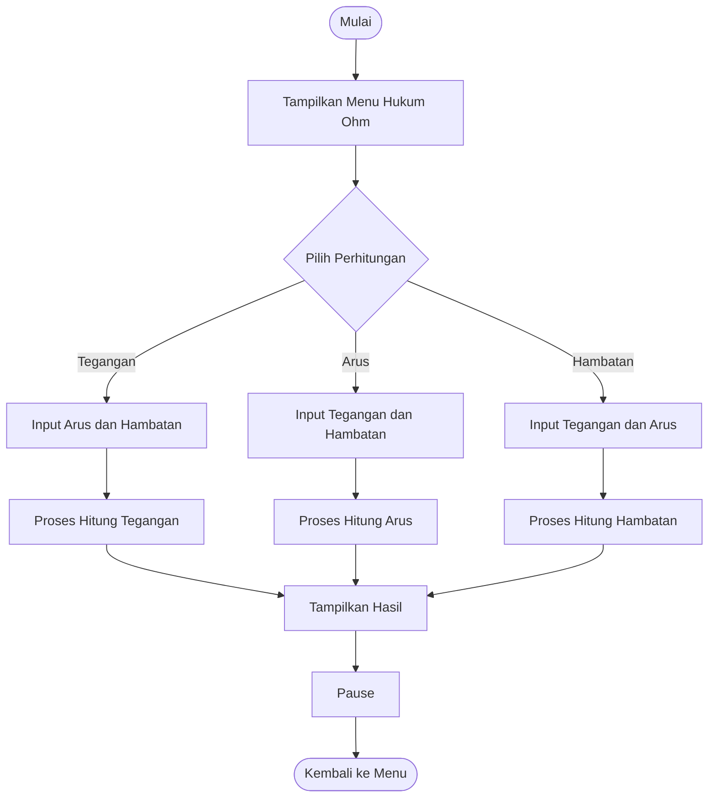
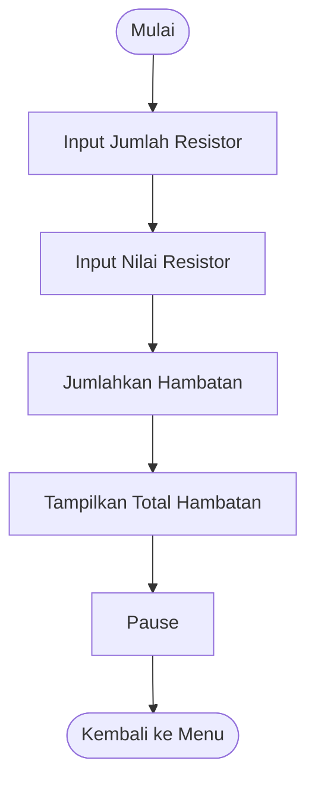

# KALKULATOR DASAR PEMROGRAMAN (C)

## Informasi Umum
Program ini merupakan aplikasi **kalkulator berbasis console** yang dibuat menggunakan bahasa pemrograman **C**. Program ini digunakan untuk melakukan **perhitungan dasar rangkaian listrik** serta **konversi sistem bilangan** yang berkaitan dengan bidang **Teknik Telekomunikasi** dan **Sistem Digital**.

Program dirancang menggunakan konsep **menu-driven**, sehingga pengguna dapat memilih fitur yang diinginkan melalui menu utama.

---

## Identitas Pembuat

- **Institusi** : Institut Teknologi Sepuluh Nopember (ITS)
- **Program Studi** : Teknik Telekomunikasi

### Nama Anggota:
1. Rafael Gerwin Andirano
2. Fahrega Nur Cholid
3. Javier Efforadion S.N

---

## Fitur Program

### A. Verifikasi Rangkaian Elektrik
- Kalkulator Hukum Ohm
- Kalkulator Daya Listrik
- Perhitungan Resistor Seri
- Perhitungan Resistor Paralel

### B. Utilitas Sistem Digital
- Konversi Desimal ke Biner, Oktal, dan Heksadesimal
- Konversi Biner ke Desimal
- Konversi Oktal ke Desimal
- Konversi Heksadesimal ke Desimal

---

## Struktur Program

Program disusun secara modular menggunakan beberapa fungsi agar kode lebih rapi dan mudah dipahami.

Fungsi-fungsi utama yang digunakan:
- `hukumOhm()`
- `dayaListrik()`
- `resistorSeri()`
- `resistorParalel()`
- `desimalKeLain()`
- `binerKeDesimal()`
- `oktalKeDesimal()`
- `heksaKeDesimal()`
- `pause()`

---

## Flowchart Program

### 1. Flowchart Utama (Main Program)


---

### 2. Flowchart Hukum Ohm



---

### 3. Flowchart Daya Listrik


---

### 4. Flowchart Resistor Seri



---

### 5. Flowchart Resistor Paralel


---

### 6. Flowchart Konversi Bilangan


---

## Cara Menjalankan Program

1. Pastikan compiler C telah terpasang (contoh: GCC)
2. Simpan file program dengan ekstensi `.c`
3. Buka terminal atau command prompt
4. Compile program dengan perintah:
   ```bash
   gcc kalkulator.c -o kalkulator
   ```
5. Jalankan program:
   ```bash
   ./kalkulator
   ```

---

## Tujuan Pembuatan

Program ini dibuat untuk:
- Memenuhi tugas mata kuliah Dasar Pemrograman
- Melatih penggunaan fungsi, percabangan, dan perulangan dalam bahasa C
- Menerapkan konsep rangkaian listrik dasar
- Memahami konversi sistem bilangan digital

---

## Penutup

Dengan adanya program ini, diharapkan mahasiswa dapat memahami penerapan bahasa C dalam menyelesaikan permasalahan teknik, khususnya di bidang **Teknik Telekomunikasi**.

Terima kasih.

