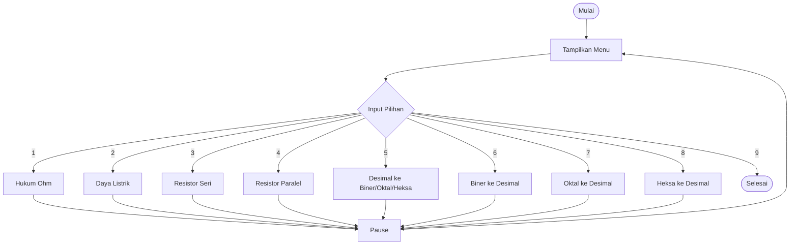

# KALKULATOR DASAR PEMROGRAMAN (C)

## Informasi Umum
Program ini merupakan aplikasi **kalkulator berbasis console** yang dibuat menggunakan bahasa pemrograman **C**. Program dirancang untuk membantu melakukan **perhitungan dasar pada rangkaian listrik** serta **konversi sistem bilangan** yang sering digunakan dalam bidang teknik, khususnya teknik telekomunikasi dan sistem digital.

Program ini bersifat **menu-driven**, sehingga pengguna dapat memilih fitur yang diinginkan melalui menu yang ditampilkan pada layar.

---

## Identitas Pembuat

- **Institusi** : Institut Teknologi Sepuluh Nopember (ITS)
- **Program Studi** : Teknik Telekomunikasi

### Nama Anggota:
1. Rafael Gerwin Andirano  
2. Fahrega Nur Cholid  
3. Javier Efforadion S.N

---

## Fitur Program

### 1. Verifikasi dan Perhitungan Rangkaian Elektrik
- Kalkulator **Hukum Ohm**
  - Menghitung Tegangan (V)
  - Menghitung Arus (I)
  - Menghitung Hambatan (R)
- Kalkulator **Daya Listrik**
- Perhitungan **Resistor Seri**
- Perhitungan **Resistor Paralel**

### 2. Utilitas Sistem Digital
- Konversi **Desimal ke Biner, Oktal, dan Heksadesimal**
- Konversi **Biner ke Desimal**
- Konversi **Oktal ke Desimal**
- Konversi **Heksadesimal ke Desimal**

---

## Struktur Program

Program disusun menggunakan beberapa fungsi agar kode lebih terstruktur dan mudah dipahami, antara lain:

- `hukumOhm()` → Menghitung nilai berdasarkan hukum Ohm
- `dayaListrik()` → Menghitung daya listrik
- `resistorSeri()` → Menghitung total hambatan seri
- `resistorParalel()` → Menghitung total hambatan paralel
- `desimalKeLain()` → Konversi desimal ke biner, oktal, dan heksadesimal
- `binerKeDesimal()` → Konversi biner ke desimal
- `oktalKeDesimal()` → Konversi oktal ke desimal
- `heksaKeDesimal()` → Konversi heksadesimal ke desimal
- `pause()` → Menjeda tampilan sebelum kembali ke menu utama

---

## Flowchart Program

### Flowchart Utama (Main Program)



### Flowchart Contoh: Hukum Ohm

```mermaid
flowchart TD
    A([Mulai]) --> B[Tampilkan Menu Hukum Ohm]
    B --> C{Pilih Perhitungan}
    C -->|Tegangan (V)| D[Input I dan R]
    D --> E[Hitung V = I x R]
    C -->|Arus (I)| F[Input V dan R]
    F --> G[Hitung I = V / R]
    C -->|Hambatan (R)| H[Input V dan I]
    H --> I[Hitung R = V / I]
    E --> J[Tampilkan Hasil]
    G --> J
    I --> J
    J --> K[Pause]
    K --> L([Kembali ke Menu])
```

---


## Cara Menjalankan Program

1. Pastikan compiler C (seperti `gcc`) sudah terpasang
2. Simpan file program dengan ekstensi `.c`
3. Buka terminal atau command prompt
4. Compile program dengan perintah:
   ```bash
   gcc kalkulator.c -o kalkulator
   ```
5. Jalankan program:
   ```bash
   ./kalkulator
   ```

---

## Tujuan Pembuatan

Program ini dibuat untuk:
- Memenuhi tugas **Dasar Pemrograman**
- Melatih penggunaan fungsi, percabangan, dan perulangan dalam bahasa C
- Menerapkan konsep **kelistrikan dasar** dan **sistem bilangan digital**
- Membiasakan pembuatan program yang modular dan terstruktur

---

## Catatan

Program ini berjalan pada mode **console** dan menggunakan input dari pengguna. Untuk hasil yang benar, pastikan data yang dimasukkan sesuai dengan jenis perhitungan yang dipilih.

---

## Penutup

Dengan adanya program ini, diharapkan pengguna dapat memahami dasar pemrograman C sekaligus konsep kelistrikan dan sistem digital yang menjadi dasar dalam bidang **Teknik Telekomunikasi**.

Terima kasih.

